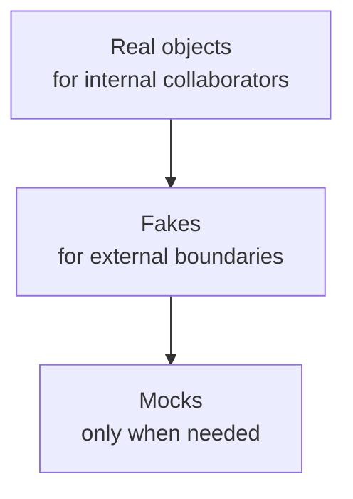
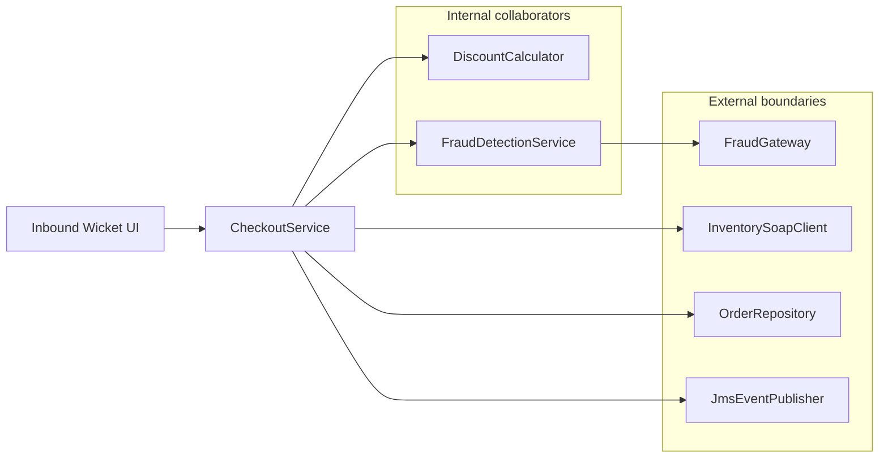

# Sociable testing with Fakes: A Pragmatic Guide to Minimal Friction Testing
- [Sociable testing with Fakes: A Pragmatic Guide to Minimal Friction Testing](#sociable-testing-with-fakes-a-pragmatic-guide-to-minimal-friction-testing)
  - [1. Introduction: Brittle Tests and Mock Overuse](#1-introduction-brittle-tests-and-mock-overuse)
    - [The Hierarchy of Test Doubles (When You Must Substitute)](#the-hierarchy-of-test-doubles-when-you-must-substitute)
  - [2. The Setup: A Relatable Enterprise Example](#2-the-setup-a-relatable-enterprise-example)
  - [3. Step 1: Fortify the Core Domain (Sociable Testing)](#3-step-1-fortify-the-core-domain-sociable-testing)
    - [The "Aha!" Code Comparison](#the-aha-code-comparison)
      - [The Brittle Approach (Solitary)](#the-brittle-approach-solitary)
      - [The Resilient Approach (Sociable)](#the-resilient-approach-sociable)
    - [Managing Fixture Complexity](#managing-fixture-complexity)
  - [4. Step 2: Tame the Database with Fakes](#4-step-2-tame-the-database-with-fakes)
    - [The Safety Net: Contract Tests](#the-safety-net-contract-tests)
  - [5. Step 3: Tame the Boundaries (UI \& Network)](#5-step-3-tame-the-boundaries-ui--network)
    - [Step 3A: The Inbound Boundary (Wicket UI)](#step-3a-the-inbound-boundary-wicket-ui)
    - [Step 3B: The Outbound Boundary (SOAP, REST, JMS)](#step-3b-the-outbound-boundary-soap-rest-jms)
      - [Which Test Double to Choose](#which-test-double-to-choose)
  - [6. Step 4: The Legacy Survival Strategy (Migration Guide)](#6-step-4-the-legacy-survival-strategy-migration-guide)
    - [Phase 1: Rescuing the Brittle Unit Test](#phase-1-rescuing-the-brittle-unit-test)
    - [Phase 2: Slicing the Ice Cream Cone (The Selenium Migration)](#phase-2-slicing-the-ice-cream-cone-the-selenium-migration)
  - [7. When Solitary Tests Make Sense](#7-when-solitary-tests-make-sense)
  - [8. Conclusion \& Safe Practice Katas](#8-conclusion--safe-practice-katas)
  - [9. References](#9-references)

## 1. Introduction: Brittle Tests and Mock Overuse
If you are working in a mature codebase, you've likely experienced this frustration: you make a simple refactoring change; extract a helper method, inline a private method, or reorder internal collaborator calls; and suddenly dozens of tests fail, even though the application's behavior has not changed. This is the cost of brittle tests: a well-documented phenomenon where tests couple to implementation details rather than observable behavior.

This pain usually comes from teams bouncing between two flawed testing extremes. On one end is the familiar Ice Cream Cone anti-pattern (a.k.a. Inverted Testing Pyramid) [[15]](#ref15), where teams seek confidence by over-relying on slow, flaky End-to-End (E2E) and heavy integration tests. On the other end is the Mock Overuse pattern, where teams try to regain speed by writing solitary unit tests that heavily mock internal collaborators, producing a brittle suite that breaks on every structural refactor.

This guide offers a way out of both traps. By adopting a "Sociable" testing style and using Fakes at your architectural boundaries, you can achieve the high behavioral confidence of an integration test with the speed and refactoring safety of a well-written unit test.

> Note: the examples in this article intentionally use Java 8, JUnit 4, Wicket 7.x, and the latest compatible Mockito version so the patterns stay easy to apply in long-lived enterprise codebases. The same approach maps cleanly to newer stacks as well.
>
> **JUnit 4 → JUnit 5 Quick Reference** (for readers using the SimpleBank starter project or any JUnit 5 codebase):
>
> | JUnit 4 | JUnit 5 |
> |---|---|
> | `@RunWith(MockitoJUnitRunner.class)` | `@ExtendWith(MockitoExtension.class)` |
> | `@Before` | `@BeforeEach` |
> | `@After` | `@AfterEach` |
> | `@BeforeClass` | `@BeforeAll` |
> | `@Test` (from `org.junit`) | `@Test` (from `org.junit.jupiter.api`) |
> | `Assert.assertEquals(...)` | `Assertions.assertEquals(...)` (or use `import static`) |

This guide advocates the sociable style of testing [[2]](#ref2). There is a long-running community debate about how much to rely on mocks and when to prefer state-based behavior verification; Martin Fowler's "Mocks Aren't Stubs" article is the canonical statement of that view [[1]](#ref1). We favor the sociable approach for domain logic in mature codebases while still accepting mocks where they are the best fit at architectural boundaries.

> Note: Fowler uses the terms “mockist” and “classicist” to describe broader TDD philosophies, while “solitary” and “sociable” describe test isolation styles. This article keeps the focus on the latter pair.

The Testing Honeycomb, popularized by Spotify for microservices testing [[3]](#ref3), emphasizes a thick middle layer of tests that verify real component interactions. The model aims to avoid the pitfalls of two extremes:
1. **The Top Extreme (E2E / Broad Integration):** Relying on tests that require live, external systems. These are slow, brittle, and cause cascading failures when unrelated dependencies break.
2. **The Bottom Extreme (Solitary Unit Tests):** Relying entirely on heavily mocked tests that verify isolated implementation details rather than real outcomes.

Instead, the Honeycomb's thick middle layer focuses on what we call **Sociable Tests**. These tests verify the service by letting it interact with its real internal components and realistic data fixtures (like in-memory Fakes), providing the high confidence of an integration test while running in a fast, isolated environment.

```
      _______
     /       \
    / E2E &   \ <-- Minimize (The Ice Cream Cone Trap)
   / BROAD INT \
  /_____________\
 /               \
/    SOCIABLE     \ <-- Focus (The Honeycomb Sweet Spot)
\   (Component)   /
 \_______________/
  \  SOLITARY   / <-- Minimize (The Mock Overuse Trap)
   \___________/
```

**The Honeycomb's Key Distinction:**

| Test Category | Architecture Stance | Reason |
|---|---|---|
| **E2E / Broad Integration** | Minimize | A failure in a live external dependency breaks your test suite. Too slow and fragile for frequent feedback. |
| **Sociable Tests** (The Middle) | Prioritize | They test real-world interactions between internal components using fast, isolated Fakes. Provides the highest ROI for your test suite. |

A related idea is Kent C. Dodds' Testing Trophy model [[4]](#ref4), which highlights the confidence-for-cost tradeoff of integration tests in JavaScript applications while still valuing unit and E2E tests in appropriate proportions. Both models share the same insight: test at the level that gives you the most confidence with the least maintenance cost, often by validating component interactions rather than isolated implementation details.

To regain our ability to refactor safely, we need a paradigm shift: move from "Solitary" testing, where every dependency is mocked, to "Sociable" testing, where clusters of collaborating objects work together naturally.

### The Hierarchy of Test Doubles (When You Must Substitute)
When a dependency cannot remain a real object, follow this preference order:
1. Prefer real objects for internal collaborators, including logic-heavy services, until they clearly earn their own test seam under the proposed decision matrix in Section 7 [[2]](#ref2).
2. Prefer Fakes (lightweight, fully functional in-memory implementations) for external boundaries such as databases, remote APIs, message brokers, and file systems [[6]](#ref6).
3. Use mocks when:
   - constructing a Fake is impractical
   - verifying specific interactions across an architectural boundary (for example, "was the cache called?" or "was a message published?")
   - simulating error conditions that cannot be easily programmed into your Fake
  
This hierarchy keeps the test suite resilient and prevents the typical overuse of mocks.  


Alongside this preference order, the xUnit Test Patterns taxonomy [[5]](#ref5) distinguishes the main kinds of test doubles:
- **Dummy** - passed but never used, just to fill parameter lists.
- **Fake** - a working implementation with shortcuts, such as an in-memory database.
- **Stub** - provides canned responses to calls.
- **Spy** - records interactions for later verification.
- **Mock** - has pre-programmed expectations that are verified after execution.

The important boundary is architectural, not psychological. Fakes are for awkward external dependencies, not for isolating your own internal classes just because they contain some logic [[2]](#ref2)[[6]](#ref6).

## 2. The Setup: A Relatable Enterprise Example
To ground this in reality, let's look at a standard component within a modular monolith: the CheckoutService.

This service acts as the orchestrator for placing an order. To make the example a little richer, it also has a second internal collaborator that applies fraud rules before the order is finalized. That service has some local business rules of its own, but it also consults a remote fraud API through a narrow gateway interface. Its flow is typical of enterprise I/O:

- It is invoked by an inbound Wicket UI page.
- It calculates discounts using an internal DiscountCalculator.
- It runs a fraud/risk check using an internal FraudDetectionService.
- It checks real-time inventory by calling an external InventorySoapClient.
- It persists the final order using an OrderRepository.
- It fires an asynchronous event via a JmsEventPublisher.



```java
public class CheckoutService {
    private final DiscountCalculator discountCalculator;
    private final FraudDetectionService fraudDetectionService;
    private final InventorySoapClient inventoryClient;
    private final OrderRepository repository;
    private final JmsEventPublisher jmsPublisher;

    public CheckoutService(DiscountCalculator calc, FraudDetectionService fraud,
                           InventorySoapClient inv, OrderRepository repo, JmsEventPublisher jms) {
        this.discountCalculator = calc;
        this.fraudDetectionService = fraud;
        this.inventoryClient = inv;
        this.repository = repo;
        this.jmsPublisher = jms;
    }

    public CheckoutResult process(OrderRequest request) {
        if (!inventoryClient.checkStock(request.getSku(), request.getQuantity())) {
            return CheckoutResult.failed("Out of stock");
        }
        if (!fraudDetectionService.isApproved(request)) {
            return CheckoutResult.failed("Fraud check failed");
        }
        
        BigDecimal discountedTotal = discountCalculator.apply(request.getTotal(), request.getCustomerType());
        
        Order order = new Order(request.getSku(), request.getQuantity(), discountedTotal);
        repository.save(order);
        // Note: Assumes repository mutates the order to assign an ID (standard JPA/Hibernate behavior)
        jmsPublisher.publish("ORDER_PROCESSED", order.getId());
        
        return CheckoutResult.success(order);
    }
}
```

```java
public class FraudDetectionService {
    private final FraudGateway fraudGateway;

    public FraudDetectionService(FraudGateway fraudGateway) {
        this.fraudGateway = fraudGateway;
    }

    public boolean isApproved(OrderRequest request) {
        if (request.getQuantity() > 10) {
            return false;
        }

        return fraudGateway.passesRemoteChecks(request);
    }
}
```

## 3. Step 1: Fortify the Core Domain (Sociable Testing)
The Myth: Every single class needs its own isolated unit test.
The Reality: Conventional testing advice often says "every class needs its own unit test." Martin Fowler calls these solitary unit tests [[2]](#ref2)-tests that mock all dependencies and exercise a class in isolation.

This isn't universally wrong. Solitary tests have their place for edge cases, slow external systems, and complex algorithms with dependencies. But when applied dogmatically to domain logic, they create implementation-coupled tests that break on every refactor. The alternative is sociable unit tests: tests that verify behavior across collaborating objects without mocking internal dependencies.

### The "Aha!" Code Comparison
Let's look at how the traditional Solitary approach destroys refactoring safety compared to the Sociable approach.

Before looking at the code, keep this high-level distinction in mind:
* **Traditional Solitary Unit Tests:** Rely heavily on mocks and stubs for *all* dependencies. They are fast, but miss real interaction bugs and become brittle when your internal mocks drift from reality.
* **Sociable Tests:** Use minimal or no mocks for *internal* collaborators. Real components and realistic fixtures are used instead, giving you high confidence in the actual behavior without the fragility of E2E tests.

#### The Brittle Approach (Solitary)
Notice how the solitary test uses Mockito to mock our own domain logic. Here we see a lethal combination: stubbing state (when().thenReturn()) and mocking interactions (verify()) on internal collaborators.

```java
@RunWith(MockitoJUnitRunner.class)
public class CheckoutServiceSolitaryTest {
    @Mock private DiscountCalculator mockCalculator;
    @Mock private FraudDetectionService mockFraudDetection;
    @Mock private InventorySoapClient mockInventory;
    @Mock private OrderRepository mockRepo;
    @Mock private JmsEventPublisher mockJms;
    
    @InjectMocks private CheckoutService checkoutService;

    @Test
    public void testProcess_Success() {
        // We are stubbing internal state rather than calculating it
        when(mockInventory.checkStock(anyString(), anyInt())).thenReturn(true);
        when(mockFraudDetection.isApproved(any())).thenReturn(true);
        when(mockCalculator.apply(any(), any())).thenReturn(new BigDecimal("90.00"));
        
        checkoutService.process(new OrderRequest("SKU123", 1, new BigDecimal("100.00"), "VIP"));
        
        // This asserts implementation (mocking), not behavior!
        // If we change the number or order of collaborator calls, this test breaks even though the result is the same.
        verify(mockCalculator).apply(any(), any()); 
    }
}
```
#### The Resilient Approach (Sociable)
By dropping the mocks for our domain services and instantiating the real DiscountCalculator and real FraudDetectionService, the test verifies real business behavior. The remote fraud API is still an awkward collaborator, so we fake that dependency one layer down.

```java
public class CheckoutServiceSociableTest {
    private CheckoutService checkoutService;
    private DiscountCalculator realCalculator;
    private FraudDetectionService realFraudService;
    private FakeFraudGateway fakeFraudGateway;
    private FakeOrderRepository fakeRepo;
    private FakeJmsPublisher fakeJms;
    private FakeInventoryClient fakeInventory;

    @Before
    public void setUp() {
        realCalculator = new DiscountCalculator(); // Real object!
        fakeFraudGateway = new FakeFraudGateway();
        realFraudService = new FraudDetectionService(fakeFraudGateway);
        fakeRepo = new FakeOrderRepository();
        fakeJms = new FakeJmsPublisher();
        fakeInventory = new FakeInventoryClient();
        
        checkoutService = new CheckoutService(realCalculator, realFraudService, fakeInventory, fakeRepo, fakeJms);
        // Step 2 will show how to build these Fakes for I/O boundaries
    }

    @Test
    public void appliesDiscountAndProcessesOrder() {
        OrderRequest request = new OrderRequestBuilder().withCustomer("VIP").build();
        
        CheckoutResult result = checkoutService.process(request);
        
        assertTrue(result.isSuccess());
        // We assert against the real final state!
        assertEquals(new BigDecimal("90.00"), result.getOrder().getTotal()); 
    }

    @Test
    public void rejectsOrderWhenFraudCheckFails() {
        fakeFraudGateway.reject();

        CheckoutResult result = checkoutService.process(new OrderRequestBuilder().build());

        assertFalse(result.isSuccess());
        assertEquals(0, fakeRepo.count());
        assertEquals(0, fakeJms.count());
    }

    @Test
    public void rejectsOrderWhenQuantityIsExcessive() {
        // The business rule (Qty > 10) is verified here, at the cluster level
        OrderRequest request = new OrderRequestBuilder().withQuantity(11).build();

        CheckoutResult result = checkoutService.process(request);

        assertFalse(result.isSuccess());
        assertEquals("Fraud check failed", result.getMessage());
        // No money wasted on a remote call
        assertEquals(0, fakeFraudGateway.getInvocationCount());
    }
}
```

This is the important refinement: FraudDetectionService is still a real internal collaborator in CheckoutService tests, even though FraudDetectionService itself talks to a remote API. The awkward dependency is the FraudGateway, so that is what we fake. In other words, do not let a remote call hidden inside a domain service force you back into mocking the domain service itself.

While it is tempting to create a dedicated FraudDetectionServiceTest as soon as a class "owns" logic, resist this urge for trivial rules. By testing the fraud logic through the CheckoutServiceSociableTest, you ensure the business rule is anchored to the outcome that matters: order placement. This allows you to refactor, rename, or even inline the FraudDetectionService later without touching a single test case.

This is the trap to avoid: swapping Mockito for a Fake does not automatically make a class-level test worthwhile. If the class boundary itself is still trivial, stateless, and only exists to serve one higher-level flow, a dedicated test file still adds maintenance friction. Section 7 gives an explicit decision matrix for when an internal service has grown enough to deserve focused tests of its own.

### Managing Fixture Complexity
There is a tradeoff here: sociable tests require more complex setup. If you need an OrderRequest, you might also need a Customer, an Address, and a Product.

Zero-friction here does not mean zero setup. It means low refactoring friction once the behavior is covered by the right test seam.

To prevent your tests from drowning in boilerplate, implement the Test Builder [[8]](#ref8) and Object Mother [[7]](#ref7) patterns.

A Test Builder provides a fluent API for generating randomized, valid objects:

```java
public class OrderRequestBuilder {
    private String sku = "DEFAULT-SKU";
    private int quantity = 1;
    private BigDecimal total = new BigDecimal("100.00");
    private String customerType = "STANDARD";

    public OrderRequestBuilder withQuantity(int quantity) {
        this.quantity = quantity;
        return this;
    }

    public OrderRequestBuilder withCustomer(String type) {
        this.customerType = type;
        return this;
    }
    
    public OrderRequest build() {
        return new OrderRequest(sku, quantity, total, customerType);
    }
}
```
> **The "Sane Defaults" Rule:** The golden rule of sociable test fixtures is that a developer should only have to specify the data that matters for their specific test scenario. To prevent cascading setup fatigue (where an `Order` requires a `Customer`, which requires an `Address`), your Builder must construct a completely valid, deeply nested object graph using sane defaults for everything else.
> **Pro Tip for Lombok Users:** If your monolith uses Project Lombok [[12]](#ref12), simply add `@Builder` and `@Builder.Default` to your `OrderRequest` class to generate fluent builders automatically-eliminating the boilerplate entirely. Note that generated builders still require explicit per-test customization for important state, such as `.withCustomer("VIP")` when a specific customer type matters.

You can then combine this with an Object Mother [[7]](#ref7) to store common scenarios, like OrderMother.aVipRequest(), keeping your tests highly readable.

> **Signs Your Sociable Test Is Too Big:** Fowler notes that a sociable test may cover a small cluster of objects, but that cluster becomes too coarse-grained when it grows too large; his rule of thumb is to keep it to only a few objects [[1]](#ref1)[[2]](#ref2). Watch for these warning signs:
> - The setup is longer than the assertions in most tests, even after introducing builders or Object Mothers [[1]](#ref1)[[7]](#ref7)[[8]](#ref8).
> - The test cluster spans so many collaborators that a failure no longer points quickly to one behavior seam [[1]](#ref1).
> - Debugging a red test means stepping through half a feature instead of a small behavior slice [[1]](#ref1)[[2]](#ref2).
>
> When you notice these symptoms, don't split reflexively. Run the collaborator through the decision matrix in [Section 7](#7-when-solitary-tests-make-sense) first. If it still lands in the "Absorb" column, the fix is likely better builders or Object Mothers, not a new test file. Only extract a focused direct test for a collaborator that has genuinely earned an independent seam under those criteria.

Debugging a Failing Sociable Test: When a sociable test goes red and the source isn't immediately obvious, Fowler's recommended pattern is to write a temporary, more focused test targeting the specific collaborator you suspect. Confirm the bug, and fix it.

Crucially, evaluate the temporary test before deleting it: If it captures a meaningful edge case on its own seam, promote it to a permanent test. If it was purely a stepping-stone to isolate a one-off issue, delete it so you don't duplicate coverage.

Use granular, state-based assertions across your result objects — `result.isSuccess()`, `fakeRepo.count()`, `fakeJms.count()` — so a failure narrows down which boundary misbehaved before you reach for a debugger. However, be aware of two critical blind spots:

- **Check for Fake Bugs:** Fakes are code, too. If a sociable test fails but the production logic looks sound, verify your Fake hasn't drifted from reality by checking its Contract Tests.
- **Beware Timing Illusions:** State-based assertions like `fakeRepo.count()` tell you what happened, not when. If the order of operations matters (e.g., committing to the DB before publishing a JMS message), count-based checks won't catch race conditions. For strict ordering, you may need your Fakes to expose a recorded history (Spy-like behavior) such as `fakeJms.getPublishedMessages()`.

## 4. Step 2: Tame the Database with Fakes
The Myth: Mocking frameworks are the only fast way to isolate database repositories.
The Reality: Hand-crafted Fakes (in-memory implementations) are clearer, provide more control, and don't break when internal flows change.

A Fake is a fully working implementation of an interface that takes shortcuts for testing.

A Warning for Spring/Hibernate Users: Creating a Fake for a massive framework interface like Spring Data's JpaRepository is a nightmare. Instead, apply the Dependency Inversion Principle (DIP) [[16]](#ref16). Create a narrow, custom interface (e.g., `OrderStore`) that your service depends on, and have your Spring Repository implement that behind the scenes. You then write your Fake against that narrow interface. In this article, `OrderRepository` plays that role; it is the narrow interface your service depends on, not a Spring Data repository extending `JpaRepository`.

Instead of writing confusing Mockito stubs like when(mockRepo.save(any())).thenReturn(...), you build a simple, reusable Java class:

```java
public class FakeOrderRepository implements OrderRepository {
    private final Map<String, Order> database = new HashMap<>();

    @Override
    public void save(Order order) {
        // Simulates JPA/Hibernate behavior: the entity is mutated in place to assign an ID,
        // so callers that hold a reference to the same Order object see the ID immediately
        // after save() returns — no findById() call needed in tests.
        if (order.getId() == null) {
            order.setId(UUID.randomUUID().toString());
        }
        database.put(order.getId(), order);
    }

    public Optional<Order> findById(String id) {
        return Optional.ofNullable(database.get(id));
    }
    
    // Test helper method
    public int count() {
        return database.size();
    }
}
```

Notice the ID mutation inside the `save` method. This is a critical detail. ORMs like Hibernate mutate the entity state by assigning an ID during persistence. If your domain logic relies on that ID downstream (for example, passing it to the `JmsEventPublisher` later in the transaction), your Fake must faithfully replicate that exact state mutation. If your Fake just stores the object without assigning an ID, your sociable tests might pass locally but throw `NullPointerException`s in production.

```java
public class FakeInventoryClient implements InventorySoapClient {
    private boolean stockAvailable = true;

    @Override
    public boolean checkStock(String sku, int quantity) {
        return stockAvailable;
    }

    public void setStockAvailable(boolean available) {
        this.stockAvailable = available;
    }
}
```

### The Safety Net: Contract Tests
As Mark Seemann notes [[6]](#ref6), "Fakes are Test Doubles with contracts"; meaning Fakes must faithfully implement the same interface semantics as the production dependency. To ensure your Fake doesn't drift from how your real Oracle or PostgreSQL database behaves, you must run a shared suite of "Contract Tests." These are identical tests run against both the FakeOrderRepository and a real database instance (spun up via Testcontainers [[11]](#ref11)) to guarantee their behaviors perfectly match.

Without this safety net, your Fake can silently drift from production behavior: transaction semantics are often simplified or skipped, concurrent access and locking behavior may differ, and edge cases such as null handling or error recovery can be missed.

This contract testing layer is your secret weapon against the Ice Cream Cone. By isolating the database verification to a few highly focused contract tests, you guarantee your Fakes behave exactly like production. This is what finally gives your team the confidence to **delete** the dozens of slow, end-to-end tests that only hit the database to indirectly prove a business rule worked. The heavy behavioral logic runs entirely in memory against the Fake, while the database boundary is proven to be safe exactly once.

> **Warning: When Your Fake Outgrows Its Role:** If a Fake for an external boundary starts to accumulate branching logic, looping, or hidden rules that are themselves hard to specify as a contract [[6]](#ref6), that is a signal the Fake may be taking on too much. Consider whether a real integration test spun up via Testcontainers [[11]](#ref11) would be cleaner, or whether the Fake's growing complexity is exposing over-broad interface responsibilities that should be narrowed.

## 5. Step 3: Tame the Boundaries (UI & Network)
### Step 3A: The Inbound Boundary (Wicket UI)
Subcutaneous sociable tests; tests that exercise the system just below the UI layer, driving real domain and infrastructure wiring while skipping browser rendering; perfectly prove that the CheckoutService works, but they don't prove that your Wicket HTML form actually passes the correct data down to the service. While your instinct might be to write a slow Selenium browser test, there is a better way.

Enter Component UI Testing using Apache Wicket's WicketTester [[9]](#ref9). This is the one place where using a mock is the right choice. In Hexagonal Architecture (Ports and Adapters) terms [[10]](#ref10), the UI is the Adapter and the Service is the Port. We mock the Port to test the Adapter in isolation, focusing purely on the UI wiring rather than domain logic.

This is an exception to the "do not mock your own code" default, not a retreat from it. The seam here is architectural: we are testing the adapter in isolation, not trying to break apart the internal domain cluster.

```java
public class CheckoutPageTest {
    private WicketTester tester;
    @Mock private CheckoutService mockCheckoutService;

    @Before
    public void setUp() {
        MockitoAnnotations.initMocks(this);
        tester = new WicketTester(new MyMockApplication(mockCheckoutService));
    }

    @Test
    public void submitForm_routesDataToService() {
        // Start the page
        tester.startPage(CheckoutPage.class);
        
        // Fill out the HTML form elements
        FormTester formTester = tester.newFormTester("checkoutForm");
        formTester.setValue("skuField", "WIDGET-X");
        formTester.setValue("quantityField", "5");
        
        // Simulate clicking the button
        formTester.submit("submitBtn");
        
        // Verify the UI successfully mapped the inputs and called the service
        verify(mockCheckoutService).process(argThat(req -> 
            req.getSku().equals("WIDGET-X") && req.getQuantity() == 5
        ));
    }
}
```

While this example uses Wicket, the architectural principle applies everywhere: mock the domain port to test the UI/Network adapter in isolation. In modern stacks, this is equivalent to using a Spring `@WebMvcTest` with `@MockBean` for your controllers, or using React Testing Library to test a UI component while mocking the Axios HTTP client. 

This runs entirely in-memory in roughly 50 milliseconds, giving you total confidence in your UI binding without the flaky overhead of End-to-End tests.

Notice what this page test does not care about: whether CheckoutService later delegates to FraudDetectionService, whether FraudDetectionService calls FraudGateway, or how any downstream adapter behaves. Those are service-level concerns. The Wicket test is only responsible for proving the HTML form maps correctly onto the CheckoutService contract.

### Step 3B: The Outbound Boundary (SOAP, REST, JMS)
Inside your sociable unit tests, you still have external network boundaries to deal with. What should you substitute?

While **Step 3A** showed how to use a mock to isolate an inbound UI adapter from the core domain, testing the domain itself requires a different mindset. When writing sociable domain tests, follow this strict 4-point checklist for determining when an **outbound infrastructure dependency** deserves a test double. Substitute dependencies only when they are:

1. External to your bounded context
2. Too slow for fast test execution
3. Non-deterministic (network calls, random values)
4. Resource-intensive (actual databases, file systems)

If a Fake is too expensive to implement for the current change because the protocol is complex or the real behavior is not well specified, use a mock temporarily at that boundary and create a follow-up ticket to replace it with a Fake later. Don't let feature progress stop on an expensive Fake, but do treat the mock as a temporary compromise rather than the architectural ideal.

This section answers the boundary question: once a dependency is external and awkward, what kind of double should you use? The separate question of whether an internal service deserves its own test file is handled later in Section 7 [[2]](#ref2).

#### Which Test Double to Choose
| Scenario | Recommended Approach |
|----------|----------------------|
| Slow external dependency (database, API) | **Fake** (in-memory implementation) |
| Error condition simulation (timeouts, failures) | **Fake** (with built-in failure toggles) preferred; **Mock** if a Fake is impractical |
| Boundary interaction verification ("was a message published?") | **Fake** preferred (e.g., `FakeJmsPublisher`); **Spy** or **Mock** if Fake is impractical |
| Internal domain collaborator | **Real object** (sociable test) |
| Trivial internal service with one caller | **Absorb into the higher-level sociable cluster** |

For the "Error condition simulation" row, while using a mock configured to throw is common, the truly pragmatic approach in a mature suite is to build failure modes directly into your Fakes. This keeps your test setup consistent and avoids leaky abstractions where low-level infrastructure exceptions (like SoapTimeoutException) bleed into your domain tests.

First, give your Fake the ability to simulate network failures:

```java
public class FakeInventoryClient implements InventorySoapClient {
    private boolean stockAvailable = true;
    private boolean simulateTimeout = false;

    @Override
    public boolean checkStock(String sku, int quantity) {
        if (simulateTimeout) {
            throw new SoapTimeoutException("Inventory service unavailable");
        }
        return stockAvailable;
    }

    public void simulateTimeout() {
        this.simulateTimeout = true;
    }
    // ... existing methods ...
}
```

Now, your error-path test can remain sociable, clean of Mockito boilerplate, and strictly verify your domain's behavior (that it catches the exception and returns a cleanly formatted domain failure):

```java
@Test
public void returnsFailureWhenInventoryServiceTimesOut() {
    // 1. Configure the Fake to simulate a network timeout
    fakeInventory.simulateTimeout();

    // 2. Execute the sociable cluster
    CheckoutResult result = checkoutService.process(new OrderRequestBuilder().build());

    // 3. Assert on your domain contract — e.g., clean failure message, no order persisted
    assertFalse(result.isSuccess());
    assertEquals("Inventory service unavailable", result.getMessage());
    assertEquals(0, fakeRepo.count());
}
```

This demonstrates the true power of Fakes: they don't just replace the happy path, they become a programmable simulator for your hardest-to-reach edge cases.

Because the InventorySoapClient, JmsEventPublisher, and remote FraudGateway fit these criteria perfectly, we replace them with Fakes rather than brittle Mockito chains.

```java
public class FakeFraudGateway implements FraudGateway {
    private boolean approved = true;
    private int invocationCount = 0;

    @Override
    public boolean passesRemoteChecks(OrderRequest request) {
        invocationCount++;
        return approved;
    }

    public int getInvocationCount() {
        return invocationCount;
    }

    public void approve() {
        this.approved = true;
    }

    public void reject() {
        this.approved = false;
    }
}
```

```java
public class FakeJmsPublisher implements JmsEventPublisher {
    private final List<String> publishedMessages = new ArrayList<>();

    @Override
    public void publish(String topic, String message) {
        publishedMessages.add(topic + ":" + message);
    }

    public void reset() {
        publishedMessages.clear();
    }

    // Helper method for our tests
    public boolean wasPublished(String topic, String message) {
        return publishedMessages.contains(topic + ":" + message);
    }

    public int count() {
        return publishedMessages.size();
    }
}
```

> **Note for testing purists:** By recording messages for later verification via the `wasPublished()` method, this implementation technically blends the formal definitions of a Fake and a Spy. In pragmatic enterprise testing, this hybrid approach is the standard, most effective way to handle "fire-and-forget" output boundaries like message queues or event buses.

Now the CheckoutService test can wire a real FraudDetectionService to a FakeFraudGateway, and still assert on end results such as `assertTrue(fakeJms.wasPublished("ORDER_PROCESSED", order.getId()))`.

In a real test suite, either create a fresh `FakeJmsPublisher` for each test or call `fakeJms.reset()` in `@Before` setup. That prevents state from leaking across tests and keeps the fake’s recorded history reliable.

## 6. Step 4: The Legacy Survival Strategy (Migration Guide)
You cannot rewrite an entire legacy monolith's test suite overnight. To dismantle both the Mock Overuse and the Ice Cream Cone anti-patterns, start small and migrate methodically across two fronts.

### Phase 1: Rescuing the Brittle Unit Test
When you encounter a bloated, heavily-mocked JUnit 4 test class that breaks on every structural refactor, follow these 6 steps to make it sociable:

1. **Contain the Damage:**
   - Isolate a single, highly coupled test class that frequently breaks during routine changes.
2. **Abstract the Setup:**
   - Build an Object Mother or Test Data Builder for the primary domain objects used in that test.
3. **Swap the Boundaries:**
   - Replace the infrastructure mocks (`mock(OrderRepository.class)` and `mock(JmsEventPublisher.class)`) with their Fake equivalents.
4. **Purge the Interactions:**
   - Remove brittle `verify(mock).methodName()` assertions.
   - Replace them with state-based assertions against returned objects and your newly created Fakes.
5. **Realize the Collaborators:**
   - Replace mocks of internal domain logic (e.g., `mock(DiscountCalculator.class)`) with real object instantiation.
   - If one of those collaborators hides a remote dependency, instantiate it with a Fake for that boundary instead of mocking the collaborator itself.
6. **Absorb Trivial Service Tests:**
   - If an internal service has one caller, no state, and trivial rules, pull its assertions up into the higher-level sociable test instead of preserving a separate test class.

A quick migration looks like this:

```java
// Before: a dedicated test file for a trivial internal seam
public class FraudDetectionServiceTest {
    @Test
    public void rejectsLargeOrders() {
        assertFalse(fraudDetectionService.isApproved(
            new OrderRequestBuilder().withQuantity(11).build()));
    }
}

// After: the same behavior verified at the higher-value cluster seam
@Test
public void rejectsOrderWhenQuantityIsExcessive() {
    CheckoutResult result = checkoutService.process(
        new OrderRequestBuilder().withQuantity(11).build());

    assertFalse(result.isSuccess());
    assertEquals(0, fakeFraudGateway.getInvocationCount());
}
```

### Phase 2: Slicing the Ice Cream Cone (The Selenium Migration)
When your CI pipeline is clogged with slow, flaky browser-driven tests that fail due to timing issues rather than actual bugs, push the coverage down the pyramid using this 4-step approach:

1. **Identify the Flaky Target:** Pick a single, slow Selenium test that verifies a specific business rule (e.g., "User cannot checkout with a negative quantity").
2. **Cover the Adapter (UI Wiring):** Write a 50-millisecond `WicketTester` component test to prove the HTML form correctly maps a negative quantity input to the underlying service call. Mock the service port here just to verify the adapter wiring.
3. **Cover the Port (Business Logic):** Write a fast, Sociable Unit Test for the `CheckoutService` to prove it properly rejects requests with negative quantities, using Fakes for the infrastructure.
4. **Delete the Browser Test:** With the UI-to-Service wiring proven by Wicket, and the core business logic proven by a sociable test, the Selenium test is now obsolete and redundant. Delete it. Keep only a single "Happy Path" E2E smoke test to ensure the environment itself boots correctly.

Run the suite. You have successfully converted a brittle solitary test into a robust sociable test without altering a single line of production code.

## 7. When Solitary Tests Make Sense
Solitary tests with mocks are not always wrong, but they are an exception. Furthermore, there is a distinct difference between giving a class **its own dedicated test file** and making that test **solitary** (mocking everything).

Fowler explicitly notes that a unit may be a cluster of closely related classes, but warns that sociable tests become too coarse-grained when that cluster grows too large. Before deciding to extract an internal service into a separate test file—and especially before deciding to mock its dependencies—run this proposed decision matrix:

| Criterion | Give It Its Own Test File | Absorb into the Sociable Cluster |
|----------|---------------------------|----------------------------------|
| Computational complexity | Algorithms, rule engines, or policies with more than 10 meaningful branches or conditions | Simple conditionals such as `if (quantity > 10)` |
| Independent reuse | The service is called by 3 or more distinct entry points | The service has a single caller |
| Stateful behavior | The service manages internal state such as caching, rate limiting, or long-lived coordination | The service is stateless |
| Published contract | The service is a public API, library boundary, or otherwise stable seam other code depends on | The service is an internal implementation detail |

To ground this in reality, consider these two extremes:

- Separate Test File (The TaxCalculator): An independent service with complex jurisdiction-specific rules, multiple edge cases such as exemptions and rounding, and no side effects. Because it represents a distinct domain concept and is reused across multiple flows, isolating it keeps tax-specific setup out of the CheckoutService test.
- Absorb into the Cluster (The UserDisplayNameFormatter): A simple internal collaborator that concatenates strings and handles null checks. Its behavior only matters inside the larger UserProfile workflow. Isolating it would produce tests that are structurally identical to the sociable tests, adding maintenance friction for no extra confidence.

If most signals land in the right-hand column, keep the behavior in the broader sociable test. That is why this guide verifies the fraud quantity rule through `CheckoutServiceSociableTest` rather than creating a dedicated test file for a single branch. If a service *does* land in the left-hand column and earns its own test file, default to testing it sociably with real sub-components unless those sub-components are awkward external boundaries.

Warning: the Fake-based solitary trap. Replacing Mockito with a Fake does reduce interaction coupling because Fakes honor a dependency contract rather than a behavior script [[6]](#ref6), but it does not justify a dedicated test file by itself. A test can still be brittle if it is locked to an internal class boundary that has no independent value [[1]](#ref1).

Use solitary tests with mocks for:
- Edge cases and error conditions: simulating database failures, timeouts, or malformed input (Note: If your Fake can be configured to simulate these, prefer the Fake over a mock).
- Slow or non-deterministic dependencies: external APIs, file systems, time-dependent code when a Fake is genuinely impractical or too expensive to build.
- Complex algorithms with dependencies: when the algorithm depends on external services or configuration, and using a Fake would be overkill

> Pro Tip on Time: Do not use mocks to test time-dependent code. Instead, pass java.time.Clock as a real dependency into your classes. In your tests, you can pass a fixed or offset Clock instance, allowing you to manipulate time naturally in a sociable test without any mocking framework overhead.

A pure algorithm such as calculateTax(income, brackets) needs no mocks, just real inputs and outputs. A truly independent fraud policy engine with several decision paths and multiple callers may deserve its own focused tests with a FakeFraudGateway, while a thin internal wrapper with one small rule usually does not.

Important: for slow external dependencies, prefer Fakes (as shown in [Step 3B](#step-3b-the-outbound-boundary-soap-rest-jms)) over mocks. Use mocks only when constructing a Fake is impractical or when you need to simulate specific error conditions.

The key principle is: mock at architectural boundaries, not inside your domain model. Test internal collaborators directly only when they provide independent value beyond the larger behavior-focused cluster.

## 8. Conclusion & Safe Practice Katas
The goal of this architecture is not to build a perfect Testing Pyramid. The goal is to write tests that establish clear boundaries, run reliably, and only fail for useful reasons. By quarantining your boundaries with Fakes and letting your core domain objects interact sociably, you will significantly reduce your maintenance friction.

Changing how you write tests requires building new muscle memory. Before tearing into the most complex parts of your monolith, practice these patterns in a safe, isolated environment.

We highly recommend two specific coding katas:

The Mars Rover Kata [[13]](#ref13): This is excellent for learning sociable testing because it involves multiple collaborating classes (Rover, Grid, Command) interacting together.

The Gilded Rose Kata [[14]](#ref14): This exercise features rich, complex business rules across multiple item types, perfectly demonstrating why behavior-focused tests are vastly superior to mock-heavy call-sequence checks.

## 9. References
1. <a id="ref1"></a>Martin Fowler, *Mocks Aren't Stubs* - The debate over mocks versus state-based verification. https://martinfowler.com/articles/mocksArentStubs.html
2. <a id="ref2"></a>Martin Fowler, *UnitTest* - Solitary vs sociable unit tests. https://martinfowler.com/bliki/UnitTest.html
3. <a id="ref3"></a>Spotify Engineering, *Testing of Microservices* - Testing Honeycomb popularization. https://engineering.atspotify.com/2018/01/testing-of-microservices
4. <a id="ref4"></a>Kent C. Dodds, *The Testing Trophy and Testing Classifications* - Integration-focused testing advice. https://kentcdodds.com/blog/the-testing-trophy-and-testing-classifications
5. <a id="ref5"></a>Gerard Meszaros, *xUnit Test Patterns* - Test doubles taxonomy. http://xunitpatterns.com/Test%20Double.html
6. <a id="ref6"></a>Mark Seemann, *Fakes are Test Doubles with Contracts* - Fakes as contracts and behavioral fidelity. https://blog.ploeh.dk/2023/11/13/fakes-are-test-doubles-with-contracts/
7. <a id="ref7"></a>Martin Fowler, *Object Mother* - Common test data patterns. https://martinfowler.com/bliki/ObjectMother.html
8. <a id="ref8"></a>Colin Jack, *Test Data Builder and Object Mother* - Fluent test data construction. http://colinjack.blogspot.com/2008/08/test-data-builder-and-object-mother.html
9. <a id="ref9"></a>Apache Wicket, *WicketTester* - In-memory UI testing utilities. https://nightlies.apache.org/wicket/apidocs/7.x/org/apache/wicket/util/tester/WicketTester.html
10. <a id="ref10"></a>Alistair Cockburn, *Hexagonal Architecture* - Ports and Adapters. https://alistair.cockburn.us/hexagonal-architecture
11. <a id="ref11"></a>Testcontainers - Container-based integration and contract testing. https://testcontainers.com/
12. <a id="ref12"></a>Project Lombok, *Builder* - Fluent builders and defaults. https://projectlombok.org/features/Builder
13. <a id="ref13"></a>Kata-Log, *Mars Rover Kata* - Sociable testing practice kata. https://kata-log.rocks/mars-rover-kata
14. <a id="ref14"></a>Emily Bache, *Gilded Rose Refactoring Kata* - Behavior-focused refactoring kata. https://github.com/emilybache/GildedRose-Refactoring-Kata
15. <a id="ref15"></a>BugBug, *Ice Cream Cone Anti-Pattern* - Pyramid vs cone testing models. https://bugbug.io/blog/software-testing/ice-cream-cone-anti-pattern/
16. <a id="ref16"></a>Mark Seemann & Steven van Deursen, *Dependency Injection: Principles, Practices, and Patterns* - Dependency inversion and boundary design. https://www.manning.com/books/dependency-injection-principles-practices-patterns